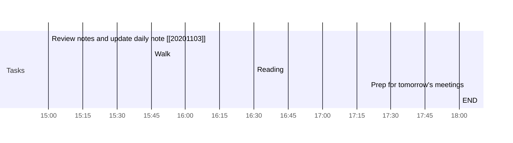

## Day Planner

```mermaid
gantt
    dateFormat  HH-mm
    axisFormat %H:%M
    %% Current Time: 17:32:05
    section Tasks
    Review notes and update daily note [[20201103]]     :15-00, 45mm
    Walk     :15-45, 45mm
    Reading     :16-30, 50mm
    Prep for tomorrow's meetings     :17-20, 40mm
    END     :18-00, 0mm
    section Breaks

```

- [x] 15:00 Review notes and update daily note [[20201103]]
- [x] 15:45 Walk
- [x] 16:30 Reading
- [ ] 17:20 Prep for tomorrow's meetings
- [ ] 18:00 END